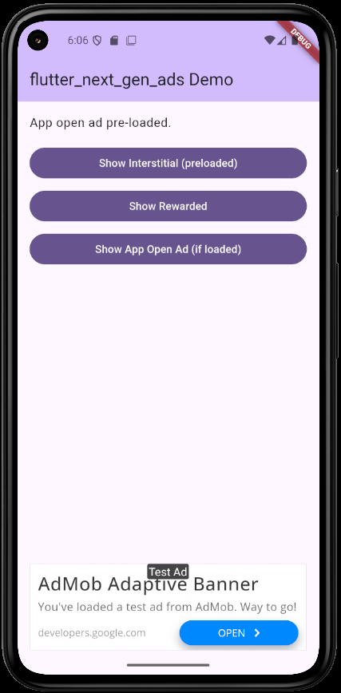

# flutter_next_gen_ads

[](https://pub.dev/packages/flutter_next_gen_ads)
[](https://opensource.org/licenses/MIT)

[English](README.md) · [한국어](README.ko.md) · [日本語](README.ja.md) · **简体中文**

面向 **Google Mobile Ads (GMA) Next-Gen SDK 1.0+** 的 Flutter 插件,在 Android
上支持横幅、插屏、激励插屏与应用开屏广告。

> ⚠️ **仅支持 Android。** GMA Next-Gen SDK 目前只在 Android 上正式发布(GA),
> iOS 端建议配合
> [`google_mobile_ads`](https://pub.dev/packages/google_mobile_ads) 一起使用。
>
> ⚠️ **非官方包。** 本包与 Google 没有任何合作、赞助或官方授权关系。
> *AdMob*、*Google Mobile Ads*、*Flutter* 均为 Google LLC 的商标,本插件仅是
> 对公开发布的 GMA Next-Gen SDK 做了一层封装,方便在 Flutter 中调用。

<p align="center">
  
</p>

## 为什么用这个包

官方 `google_mobile_ads` 插件目前仍基于 **旧版** GMA SDK。如果你希望在
Android 上直接用到 Next-Gen SDK 的新能力 —— 尤其是旧版 SDK 没有的
**`InterstitialAdPreloader`** / **`RewardedInterstitialAdPreloader`**
预加载池 —— 这个包是最直接的选择。

## 环境要求

| | |
|---|---|
| Flutter | 3.10 及以上 |
| Dart | 3.10.7 及以上 |
| Android `compileSdk` | **35** |
| Android `minSdk` | **24** |
| Kotlin | 1.9 及以上 |

## 安装

在 `pubspec.yaml` 中添加依赖:

```yaml
dependencies:
  flutter_next_gen_ads: ^0.1.0
```

在 `android/app/src/main/AndroidManifest.xml` 中配置 AdMob 应用 ID:

```xml
<application ...>
  <meta-data
      android:name="com.google.android.gms.ads.APPLICATION_ID"
      android:value="ca-app-pub-XXXXXXXXXXXXXXXX~YYYYYYYYYY"/>
  ...
</application>
```

> 本地开发时建议先使用 AdMob 的测试应用 ID
> `ca-app-pub-3940256099942544~3347511713`,正式发布前务必替换为线上 ID。

## 快速上手

### 启动时初始化一次即可

```dart
import 'package:flutter_next_gen_ads/flutter_next_gen_ads.dart';

Future<void> main() async {
  WidgetsFlutterBinding.ensureInitialized();
  await MobileAds.initialize(); // 自动从 AndroidManifest 读取 appId

  // 开发阶段务必把自己的设备加入测试设备名单,
  // 否则真实广告意外曝光会触发 AdMob 政策违规。
  await MobileAds.setRequestConfiguration(const RequestConfiguration(
    testDeviceIds: ['YOUR_DEVICE_HASH'], // 通过 logcat 获取设备哈希
  ));

  runApp(const MyApp());
}
```

### 横幅广告

```dart
SizedBox(
  height: 120,
  child: BannerAdView(
    adUnitId: 'ca-app-pub-XXX/YYY',
    size: AdSize.largeAnchored(),
  ),
)
```

也可以直接传 `height` 参数,写法更简洁:

```dart
const BannerAdView(
  adUnitId: 'ca-app-pub-XXX/YYY',
  size: AdSize.largeAnchored(),
  height: 120,
)
```

### 插屏广告

```dart
try {
  final ad = await InterstitialAd.load(
    adUnitId: 'ca-app-pub-XXX/YYY',
  );
  ad.listener = InterstitialAdListener(
    onAdDismissedFullScreenContent: () => debugPrint('dismissed'),
  );
  await ad.show();
} on AdLoadException catch (e) {
  debugPrint('load failed: ${e.error}');
}
```

### 激励插屏广告

```dart
try {
  final ad = await RewardedInterstitialAd.load(
    adUnitId: 'ca-app-pub-XXX/YYY',
  );
  await ad.show(
    onUserEarnedReward: (reward) {
      grantCoins(reward.amount); // reward.type 同样可用
    },
  );
} on AdLoadException catch (e) {
  debugPrint('rewarded failed: ${e.error}');
}
```

### 应用开屏广告(带 4 小时有效期处理)

```dart
class _RootState extends State<RootWidget> with WidgetsBindingObserver {
  AppOpenAd? _ad;

  @override
  void initState() {
    super.initState();
    WidgetsBinding.instance.addObserver(this);
    _preload();
  }

  Future<void> _preload() async {
    try {
      _ad = await AppOpenAd.load(adUnitId: 'ca-app-pub-XXX/YYY');
      _ad!.listener = AppOpenAdListener(
        onAdDismissedFullScreenContent: () {
          _ad = null;
          _preload();
        },
      );
    } on AdLoadException catch (_) {}
  }

  @override
  void didChangeAppLifecycleState(AppLifecycleState state) async {
    if (state == AppLifecycleState.resumed) {
      final ad = _ad;
      if (ad != null && await ad.isAvailable()) await ad.show();
    }
  }
  // ...
}
```

### 预加载池(Next-Gen 独有)

把插屏、激励广告提前放进预加载池,调用 `show()` 时就能立刻展示,无需等待
网络往返。

```dart
// 启动时填充缓冲池
await InterstitialAdPreloader.start(
  adUnitId: 'ca-app-pub-XXX/YYY',
  bufferSize: 2,
);

// 展示时先从池里取,池空就回退到即时加载
InterstitialAd? ad = await InterstitialAdPreloader.poll(
  adUnitId: 'ca-app-pub-XXX/YYY',
);
ad ??= await InterstitialAd.load(adUnitId: 'ca-app-pub-XXX/YYY');
await ad.show();
```

### 定向参数

```dart
const request = AdRequest(
  keywords: ['flutter', 'mobile-dev'],
  contentUrl: 'https://example.com/article-being-read',
  customTargeting: {'genre': ['action', 'adventure']},
);

final ad = await InterstitialAd.load(
  adUnitId: 'ca-app-pub-XXX/YYY',
  request: request,
);
```

## 跨平台用法(Android + iOS)

本插件只支持 Android。如果同一份代码库还需要兼容 iOS,可以条件分支到
`google_mobile_ads`:

```dart
import 'dart:io' show Platform;

Future<void> showInterstitial(String adUnitId) async {
  if (Platform.isAndroid) {
    // 使用 flutter_next_gen_ads
    final ad = await InterstitialAd.load(adUnitId: adUnitId);
    await ad.show();
  } else if (Platform.isIOS) {
    // 使用 google_mobile_ads(需另行配置)
    // ...
  }
}
```

`BannerAdView` 在非 Android 平台会自动降级为 `placeholder`,布局不会因此
错乱。

## 公开 API

从 `package:flutter_next_gen_ads/flutter_next_gen_ads.dart` 统一导出:

- `MobileAds` —— `initialize()`、`getVersion()`、`setRequestConfiguration()`
- `RequestConfiguration` 及相关枚举(`TagForChildDirectedTreatment`、
  `TagForUnderAgeOfConsent`、`MaxAdContentRating`、
  `PublisherPrivacyPersonalizationState`)
- `BannerAdView`、`BannerAdListener`、`AdSize`(`anchored`、`largeAnchored`、
  `inline` 三个工厂方法)
- `InterstitialAd`、`InterstitialAdListener`
- `RewardedInterstitialAd`、`RewardedInterstitialAdListener`、`RewardItem`
- `AppOpenAd`、`AppOpenAdListener`
- `InterstitialAdPreloader`、`RewardedInterstitialAdPreloader`
- `AdRequest`、`AdError`、`AdLoadException`

## 路线图

- **0.2.0** —— 原生广告(`NativeAd`、`NativeAdView`、`NativeAdPreloader`)
- **0.3.0+** —— iOS 支持(等待 GMA Next-Gen iOS SDK 正式发布后启动)

## 常见问题

**横幅位置是一片空白。** `BannerAdView` 必须从父级拿到明确的尺寸约束。请用
`SizedBox(height: …)` 包裹,或者直接传 `height` 参数。没有约束时,Flutter
会悄悄跳过 PlatformView 的创建。

**报 `AdLoadException(code: 3, message: No fill)`。** AdMob 当前没有能填充
这次请求的广告库存。测试广告位通常总会返回广告,稍后重试或检查广告位
ID 即可。

**模拟器上 App 一启动就被系统杀掉。** GMA SDK 加上 WebView 在运行时大概占
300MB 内存。RAM 不足 4GB 的模拟器很容易触发 OOM,建议换真机或者给模拟器
分配更多内存。

**真机上看到的是真实广告而不是测试广告。** 请确认在加载广告之前调用了
`MobileAds.setRequestConfiguration(RequestConfiguration(testDeviceIds: [...]))`。
设备哈希可以在 logcat 里搜索关键字
`Use RequestConfiguration.Builder.setTestDeviceIds` 找到。

## 赞助

<p align="center">
  <a href="https://github.com/sponsors/ahngo13">
    
  </a>
</p>

如果这个包帮你省下了一天的工作量,不妨也赞助我一天的工作。

赞助款项会用于:

- **0.2.0 原生广告** —— 正在开发
- **缺陷修复与 SDK 升级** —— 紧跟 Google 的版本节奏
- **Issue 与 PR 跟进** —— 以天为单位回应,而不是拖几周

由来自韩国首尔的独立 Flutter 开发者
[**Hamlet Shu**](https://github.com/ahngo13) 构建并维护。

## 许可证

MIT,详见 [LICENSE](LICENSE)。
